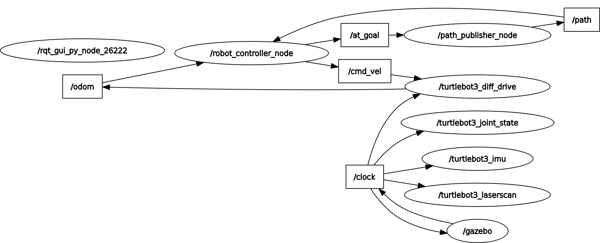
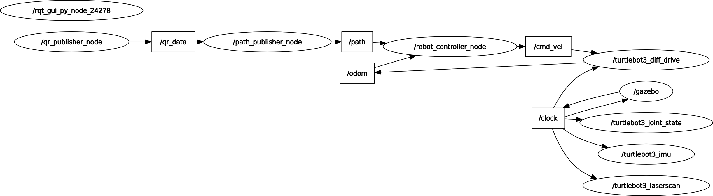

# Stigmergy Based Path Planning Using TurtleBot3 Burger Bots

Models a system of two robots in ROS2 Gazebo. Robot one uses RRT# to navigate an environment
and save its path as a QR code with a 25 character limit. Robot two reads the qr code and 
follows the stored path to its end.

## Requirements

- Ubuntu 22.04
- ROS2 Humble
- Python 3.10
- System packages: `libzbar0`

## Installation

### 1. Clone repository

**HTTPS:**
```bash
git clone https://github.com/George-Peregoy/turt-qr.git
cd turt-qr
```

**SSH:**
```bash
git clone git@github.com:George-Peregoy/turt-qr.git
cd turt-qr
```

### 2. Install System Dependencies
```bash
sudo apt-get update
sudo apt-get install libzbar0
```

### 3. Install Python Dependecies
```bash
pip install -r requirements.txt
```

**Required packages:**
- Numpy==1.21.5
- scipy==1.8.0
- matplotlib==3.5.1
- shapely==2.1.2
- imageio==2.37.2
- qrcode==8.2
- pyzba==0.1.9
- pillow==9.0.1

### 4. Build the Workspace
```bash
cd ~/turt-qr
colcon build
source install/setup.bash
```

## Package Structure

The workspace is split into three packages. Path planning is used to read and save qr data, find a viable path, and pruning. Controller subscribes to the path and finds cmd_vel. Simulation handles the launch files, converting the 2D obstacles into stl files, and combining the stl files into a proper world file. 

### path_planning

.
├── environments/
├── LICENSE
├── package.xml
├── path_planning
│   ├── config.py
│   ├── ellipses2.py
│   ├── gen_obstacles.py
│   ├── __init__.py
│   ├── path_pruning.py
│   ├── path_to_qr.py
│   ├── pose_publisher_1.py
│   ├── pose_publisher_2.py
│   ├── __pycache__
│   │   ├── config.cpython-310.pyc
│   │   └── ellipses2.cpython-310.pyc
│   ├── qr_reader_node.py
│   └── rrtsharp.py
├── qrcodes/
├── resource/
├── setup.cfg
├── setup.py
└── test/

**Nodes:**

- `pose_publisher_1.py` - Uses RRT# to navigate environment, publishes /path as nav_msgs/msg/Path, saves qr code to src/path_planning/qrcodes/.
- `pose_publisher_2.py` - Subscribes to /qr_data, converts data to nav_msgs/msg/Path, publishes //path.
- `qr_reader_node.py` - Reads QR code, publishes path as string.

**Utlilities:**

- `ellipses2.py` - Defines ellipse object, handles ellipse sampling.
- `gen_obstacles` - Generates 2D environment, saves to src/path_planning/environments.
- `path_pruning` - Prunes path by line of sight, then if needed prunes using ellipse.
- `path_to_qr` - Converts a list of points to a string to be saved as a Qr code.
- `rrtsharp` - Handles RRT# path planning.


### controller

.
├── controller
│   ├── __init__.py
│   └── robot_controller.py
├── LICENSE
├── package.xml
├── resource/
├── setup.cfg
├── setup.py
└── test/

**Nodes:**

- `robot_controller.py` - Subscribes to \path, finds publishes desired linear and angular velocity as type geometry_msgs/msg/Twist to topic /cmd_vel.

### simulation

.
├── build/
├── install/
├── launch
│   ├── launch_robot_1.py
│   └── launch_robot_2.py
├── LICENSE
├── log/
├── meshes/
├── package.xml
├── resource/
├── setup.cfg
├── setup.py
├── simulation
│   ├── env_to_world.py
│   ├── gen_world.py
│   └── __init__.py
├── test/
└── worlds/

**Launch Files:**

- `launch_robot_1.py` - Starts robot 1 simulation. Accepts world number as launch argument as world_num:=0
- `launch_robot_2.py` - Starts robot 2 simulation. Accepts world number as launch argument as world_num:=0

**Utilities:**

- `env_to_world.py` - Converts 2D obstalces into mesh files, combines mesh files into a single world file. Saves meshes to src/simulation/meshes/ Saves worlds to src/simulation/worlds
- `gen_world.py` - Generates random obstacles for 2D environment, converts 2D obstacles to world file for 3D simulation.

## Configuration

Key global variables in src/path_planning/config.py

- `ENV_X_BOUNDS = (0, 50)` - Environment X bounds (grid units)
- `ENV_Y_BOUNDS = (0, 50)` - Environment Y bounds (grid units)
- `START = (45, 45)` - Robot 1 start / Robot 2 goal (grid units)
- `GOAL = (5, 5)` - Robot 2 start / Robot 1 goal (grid units)
- `ROBOT_RADIUS = 0.105` - TurtleBot3 Burger radius (meters)
- `BUFFER = 0.125` - Total obstacle clearance (meters)
- `WORLD_SCALE = 0.1` - Conversion: meters per grid cell
- `STEP_SIZE = 5` - RRT# branch length (grid units)
- `CHAR_LIMIT = 25` - Max QR code characters (alphanumeric)

## Usage

To generate worlds run `python3 src/simulation/gen_world.py`.
It is set to generate five random worlds. After running this you must use `colcon build` to save the worlds to the workspace.

To launch robot 1 run `ros2 launch simulation launch_robot_1.py world_num:=0`. Note that the world_num argument is optional and defaults to 0.

To launch robot 2 run `ros2 launch simulation launch_robot_2.py world_num:=0`. Note that the world_num argument is optional and defaults to 0.

## Architecture Diagram 

These are the ROS2 rqt graphs for each robot.

### Robot 1



*Figure 1: Node communication topology showing Robot 1 architecture*

### Robot 2



*Figure 2: Node communication topology showing Robot 2 architecture*

## How it works

### Environment generation

The environment uses randomly generated Polygons from shapely. These Polygons are what's used for path planning, and are buffered using Shapely's built-in buffer method. The obstacles are then converted to an stl file by breaking up the vertices and creating a series of connected triangles. These triangles are combined into a single mesh to represent an obstacle. The meshes match the 2D obstacles but are extruded a constant one meter. The meshes are then combined into a single world file. 

### Robot 1

Robot one is the initial path planner, it uses RRT# to get a viable path from start to goal. Once it reaches the goal it converts its path into an alphanumeric QR code. The constraint on the QR code is that it must 25 characters or less, if the original path is too long the robot uses line of sight pruning, and if needed ellipse pruning.

### Robot 2

Robot two has no information on the environment. It reads the QR code using pyzbar and follows path exactly. If there is an ellipse in the path, robot 2 uses RRT# to patch the ellipse and continues until at the goal.